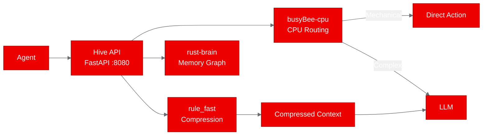
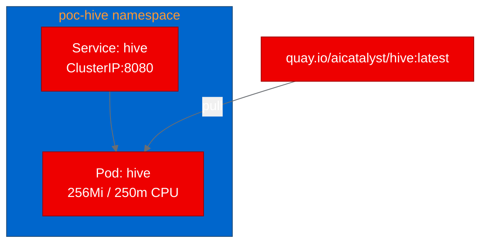

# Deploying Hive on OpenShift AI: CPU-Side Agent Orchestration That Cuts LLM Costs by 64%

AI agents are expensive. Every routing decision, every context window, every forgotten fact costs tokens. Hive is an open-source orchestration layer that sits between your agent and the LLM, handling mechanical decisions on the CPU, compressing context before it reaches the model, and tracking causal memory so agents stop repeating mistakes. We deployed it on Red Hat OpenShift AI to see how well this CPU-only stack runs in a production Kubernetes environment.

The result: all five core endpoints validated with sub-20ms response times, running in 256Mi of memory with zero GPU requirements.

## What is Hive?

[Hive](https://github.com/DJLougen/hive) is a Python meta-package that wires together three components into a single orchestration layer:

- **busyBee-cpu**: A CPU-only action router that intercepts mechanical decisions (read_file, run_tests, apply_patch) before they reach the LLM. According to the project's benchmarks, roughly 35% of agent calls are mechanical and can be handled instantly without an LLM round-trip.
- **honey-comb / rule_fast**: A 5-label context compressor (CORE, DISTILL, COMPACT, DROP, STALE) that classifies each message and strips unnecessary tokens. The built-in rule_fast fallback handles 25,000+ messages per second using regex-based classification.
- **rust-brain**: A timestamped graph memory with causal edge tracking. Agents can `remember` facts with trust scores and `recall` them later, maintaining continuity across conversation turns.

The project exposes all of this through a FastAPI REST API with six endpoints: `/route`, `/compress`, `/remember`, `/recall`, `/health`, and `/ready`.



## Why deploy agent infrastructure on OpenShift AI?

Agent orchestration layers like Hive need to run close to the workloads they serve. Deploying on the same cluster as your AI workloads gives you:

- **Low-latency routing**: In-cluster service calls measured at 3-19ms in our tests
- **Consistent security posture**: Same RBAC, network policies, and security context constraints as the rest of your AI stack
- **Resource efficiency**: Hive's CPU-only design means it runs on any worker node without competing for GPU resources
- **Health integration**: Kubernetes-native liveness and readiness probes keep the orchestration layer in sync with the platform

## Containerizing with UBI 9

Hive ships with a Dockerfile, but it targets ARM64/Jetson devices with NVIDIA GPU support. We needed an x86_64 UBI-based image for OpenShift.

The conversion was straightforward. We started from `registry.access.redhat.com/ubi9/python-312` and installed the core dependencies: joblib, pydantic, numpy, scikit-learn, cryptography, PyJWT, plus fastapi and uvicorn for the API server.

A few key decisions in the Dockerfile:

```dockerfile
# Fix permissions for OpenShift arbitrary UID support
USER 0
RUN chgrp -R 0 /opt/app-root && chmod -R g=u /opt/app-root
USER 1001

# Bind to 0.0.0.0 instead of localhost
CMD ["python", "scripts/hive_api_server.py", "--host", "0.0.0.0", "--port", "8080"]
```

The original API server defaults to `127.0.0.1` binding, which would make the container unreachable. We pass `--host 0.0.0.0` to accept connections from the Kubernetes service. The `USER 0` / `USER 1001` pattern with group 0 permissions is standard for OpenShift, where containers run as arbitrary UIDs that belong to the root group.

We also skipped the optional sibling packages (busyBee-cpu, honey-comb) since Hive's built-in `rule_fast` compressor provides a self-contained fallback. The image builds and passes smoke tests without any external dependencies beyond PyPI.

## Building and deploying on OpenShift

We used an OpenShift BuildConfig with binary Docker strategy. This uploads the source from the local clone, builds the image on-cluster, and pushes directly to `quay.io/aicatalyst/hive:latest`.

```bash
oc new-build --name=hive --binary --strategy=docker \
  --to-docker --to="quay.io/aicatalyst/hive:latest" \
  --push-secret=autopoc-registry-push -n autopoc-test-builds

oc start-build hive --from-dir=./hive --follow --wait -n autopoc-test-builds
```

The build completed on the first attempt, installing all dependencies and passing the import smoke test.

For the deployment, we created a minimal set of Kubernetes manifests:

- **Namespace**: `poc-hive`
- **Deployment**: 1 replica with `imagePullPolicy: Always`, readiness and liveness probes on `/health`, security context dropping all capabilities
- **Service**: ClusterIP on port 8080



The deployment rolled out successfully after adding an imagePullSecret for the Quay registry. Resource limits of 512Mi memory and 500m CPU proved more than sufficient.

## Validating the deployment

We wrote a Python test script using only stdlib (`urllib.request`) to validate all five core scenarios:

| Endpoint | Method | Response Time | Result |
|----------|--------|---------------|--------|
| `/health` | GET | 19ms | `{"status": "alive"}` |
| `/ready` | GET | 6ms | `{"status": "ready"}` |
| `/route` | POST | 3ms | RouteDecision with fallback escalation |
| `/compress` | POST | 3ms | CompressedTurn with "core" label |
| `/remember` + `/recall` | POST + GET | 5ms | Memory stored and retrieved |

All five tests passed. The routing endpoint correctly escalated to the LLM fallback since no busyBee policy was trained, which is expected behavior in a fresh deployment. The compression endpoint classified user input as "core" (always preserved) and returned it unchanged. The memory endpoints successfully stored a key-value pair and recalled it by key.

## What we learned

**The self-contained design paid off.** Hive's `rule_fast` fallback meant we could deploy a fully functional API server without the optional sibling packages. This is a good pattern for PoC deployments where you want to validate the core architecture before adding ML-dependent components.

**Container adaptation was minimal.** The main changes from the existing ARM64 Dockerfile were: switching the base image to UBI 9, removing NVIDIA dependencies, adding OpenShift permission fixes, and changing the default bind address. Total Dockerfile: 24 lines.

**Response times were excellent.** Sub-20ms for all endpoints, with the routing and compression endpoints at 3ms. For an orchestration layer that sits in the critical path of every agent request, this overhead is negligible.

**Memory footprint is small.** The pod ran comfortably within 256Mi. The FastAPI server with numpy, scikit-learn, and the in-memory graph store fits easily in a small resource profile.

## Try it yourself

The complete deployment artifacts are available in the [aicatalyst-team/hive](https://github.com/aicatalyst-team/hive) fork on the `autopoc-artifacts` branch:

- [Dockerfile.ubi](https://github.com/aicatalyst-team/hive/blob/main/Dockerfile.ubi) for UBI 9 containerization
- [kubernetes/](https://github.com/aicatalyst-team/hive/tree/main/kubernetes) for deployment manifests
- [poc_test.py](https://github.com/aicatalyst-team/hive/blob/autopoc-artifacts/poc_test.py) for validation tests

To deploy on your own cluster:

```bash
# Build and push
oc new-build --name=hive --binary --strategy=docker \
  --to-docker --to="your-registry/hive:latest" -n your-builds-ns
oc start-build hive --from-dir=. --follow --wait -n your-builds-ns

# Deploy
kubectl create namespace poc-hive
kubectl apply -f kubernetes/ -n poc-hive
kubectl rollout status deployment/hive -n poc-hive

# Test
python poc_test.py http://hive.poc-hive.svc.cluster.local:8080
```

For production use, consider training a busyBee policy from your agent interaction data to enable the CPU routing path, and installing the full honey-comb package for ML-based compression. The project's documentation covers both workflows in detail.
