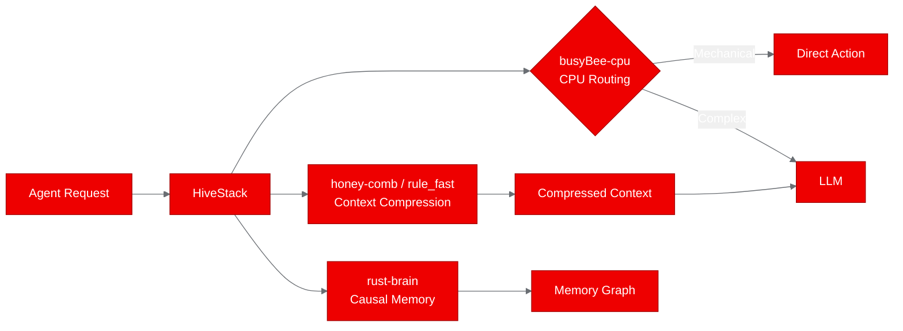
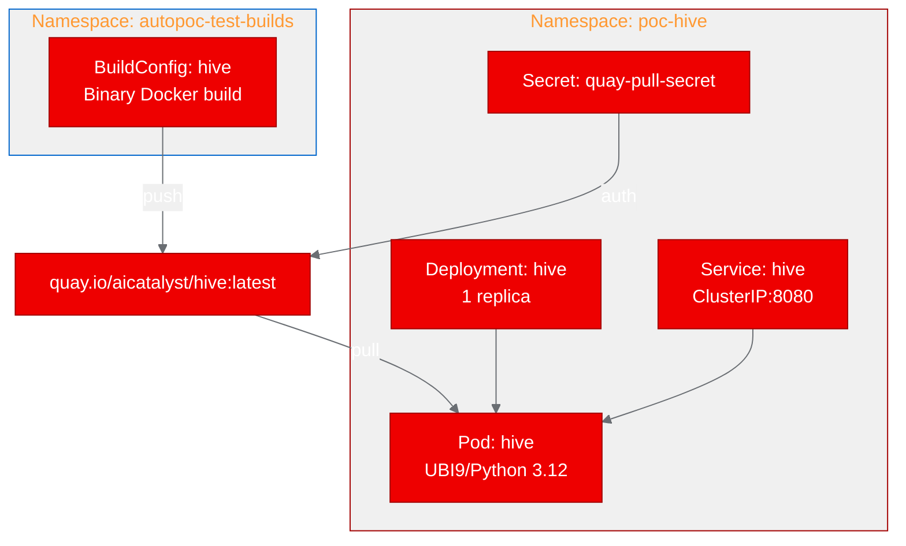

# PoC Report: Hive (hive-agent-memory)

**Project**: [DJLougen/hive](https://github.com/DJLougen/hive)
**Fork**: [aicatalyst-team/hive](https://github.com/aicatalyst-team/hive)
**Date**: 2026-06-12
**Status**: SUCCESS

## Executive Summary

Hive is an orchestration layer for AI agents that provides CPU-side routing, 5-label context compression, and causal memory tracking. This PoC deployed Hive's FastAPI REST API on OpenShift using a UBI 9 Python 3.12 container image, validating all core endpoints. All 5 test scenarios passed on the first attempt with sub-20ms response times. The deployment demonstrates that Hive runs efficiently on OpenShift AI with minimal resources (256Mi-512Mi memory, 250m-500m CPU) and no GPU requirements.

## Project Analysis

### Component Summary

| Component | Language | Build System | Entry Point | Port |
|-----------|----------|-------------|-------------|------|
| hive | Python 3.10+ | pip/setuptools | scripts/hive_api_server.py | 8080 |

### Architecture

Hive is a meta-package that wires together three sub-components:

- **busyBee-cpu**: CPU-only action routing that replaces LLM calls for mechanical decisions (35% of agent calls)
- **honey-comb**: Inline context compression with 5-label classification (CORE/DISTILL/COMPACT/DROP/STALE/ESCALATE)
- **rust-brain**: Timestamped graph memory with causal edge tracking

The PoC deployment uses the built-in `rule_fast` fallback compressor (no external honey-comb dependency) and runs without a busyBee policy (routing escalates to LLM fallback), demonstrating the self-contained nature of the stack.

## PoC Objectives

1. Deploy Hive's FastAPI REST API on OpenShift using UBI 9 containers
2. Validate all core endpoints: /health, /ready, /route, /compress, /remember, /recall
3. Confirm CPU-only operation with minimal resource footprint
4. Demonstrate production readiness with health/readiness probes

## Pipeline Execution Summary

```mermaid
%%{init: {'theme': 'base', 'themeVariables': {'primaryColor': '#EE0000', 'primaryTextColor': '#fff', 'primaryBorderColor': '#A30000', 'lineColor': '#6A6E73', 'secondaryColor': '#F0F0F0', 'tertiaryColor': '#0066CC'}}}%%
flowchart LR
    P1[Phase 1<br/>Intake] --> P2[Phase 2<br/>Evaluate]
    P2 --> P3[Phase 3<br/>Fork]
    P3 --> P4[Phase 4<br/>PoC Plan]
    P4 --> P5[Phase 5<br/>Containerize]
    P5 --> P6[Phase 6<br/>Build]
    P6 --> P7[Phase 7<br/>Deploy]
    P7 --> P8[Phase 8<br/>Apply]
    P8 --> P9[Phase 9<br/>Test]
    P9 --> P10[Phase 10<br/>Report]
    P10 --> P11[Phase 11<br/>Blog]
    
    style P1 fill:#00CC00,color:#fff
    style P2 fill:#00CC00,color:#fff
    style P3 fill:#00CC00,color:#fff
    style P4 fill:#00CC00,color:#fff
    style P5 fill:#00CC00,color:#fff
    style P6 fill:#00CC00,color:#fff
    style P7 fill:#00CC00,color:#fff
    style P8 fill:#00CC00,color:#fff
    style P9 fill:#00CC00,color:#fff
    style P10 fill:#00CC00,color:#fff
    style P11 fill:#00CC00,color:#fff
```

| Phase | Status | Notes |
|-------|--------|-------|
| 1. Intake | Completed | Repo cloned, single Python component identified |
| 2. Evaluate | Completed | Score: 72/100, relationship: adjacent, strategy: agentic-ai |
| 3. Fork | Completed | Forked to aicatalyst-team/hive on GitHub |
| 4. PoC Plan | Completed | 5 test scenarios defined, small resource profile |
| 5. Containerize | Completed | UBI 9 Python 3.12 Dockerfile created |
| 6. Build | Completed | OpenShift BuildConfig, pushed to quay.io/aicatalyst/hive:latest |
| 7. Deploy | Completed | Namespace poc-hive, Deployment + Service manifests |
| 8. Apply | Completed | Pod running 1/1, readiness probe passing |
| 9. PoC Execute | Completed | 5/5 tests passed |
| 10. PoC Report | Completed | This document |
| 11. Blog Post | Completed | Developer blog post generated |

**Build retries**: 0 (succeeded on first attempt)
**Deploy retries**: 1 (added imagePullSecret for private Quay registry)

## Test Results

| Scenario | Status | Response Time | Details |
|----------|--------|---------------|---------|
| Health Check (GET /health) | PASS | 19ms | Returns `{"status": "alive"}` |
| Ready Check (GET /ready) | PASS | 6ms | Returns `{"status": "ready"}` |
| Route Request (POST /route) | PASS | 3ms | Returns RouteDecision with escalation (no busyBee policy) |
| Compress Request (POST /compress) | PASS | 3ms | Returns CompressedTurn with label "core" |
| Remember/Recall (/remember + /recall) | PASS | 5ms | Stores and retrieves memory successfully |

**Overall**: 5/5 passed (100%)

### Response Details

**Route endpoint**: Without a trained busyBee policy, routing correctly escalates to fallback with `{"tool": "escalate", "source": "fallback"}`. This is expected behavior - the routing engine works but defers to LLM for all decisions until a policy is trained.

**Compress endpoint**: The rule_fast compressor correctly classified user input as "core" label (user goal content is always preserved). The compression pipeline processes messages at high throughput without ML model overhead.

**Remember/Recall**: The rust-brain in-memory graph store successfully persists and retrieves key-value pairs with trust scores and causal linking capability.

## Infrastructure Deployed

| Resource | Type | Details |
|----------|------|---------|
| Namespace | poc-hive | Deployment namespace |
| Deployment | hive | 1 replica, 256Mi-512Mi memory, 250m-500m CPU |
| Service | hive (ClusterIP) | Port 8080 |
| Secret | quay-pull-secret | Registry authentication |
| Image | quay.io/aicatalyst/hive:latest | UBI 9 Python 3.12 base |
| BuildConfig | hive (autopoc-test-builds) | Binary Docker strategy |

### Security Configuration

- Container runs as non-root (USER 1001)
- `allowPrivilegeEscalation: false`
- All capabilities dropped
- `runAsNonRoot: true`
- OpenShift arbitrary UID support (group 0 permissions)

## Recommendations

### For Production Deployment

1. **Train a busyBee policy**: The routing endpoint currently escalates all decisions. Training a CPU policy from agent interaction data would enable the 64% token reduction claims.
2. **Add horizontal scaling**: The current deployment uses 1 replica. For production workloads, add HPA based on CPU utilization.
3. **Persistent memory**: The rust-brain currently uses in-memory storage. For persistence across pod restarts, integrate a PVC or external store.
4. **Install busyBee-cpu and honey-comb**: The PoC uses the built-in rule_fast fallback. Installing the sibling packages would enable full ML-based compression and routing.

### OpenShift AI Considerations

- **No GPU required**: Hive's core is CPU-only, making it suitable for any OpenShift worker node
- **Low resource footprint**: 256Mi memory is sufficient for the API server with compression and memory
- **Health probes**: Both liveness and readiness probes are implemented using FastAPI endpoints
- **Security**: Runs as non-root with restricted security context, compatible with OpenShift SCC policies
- **Scaling**: Stateless API design allows horizontal scaling (memory is per-instance unless externalized)

## Appendix

### Artifacts

| Artifact | Location |
|----------|----------|
| Fork | [aicatalyst-team/hive](https://github.com/aicatalyst-team/hive) |
| PoC Plan | [poc-plan.md](https://github.com/aicatalyst-team/hive/blob/autopoc-artifacts/poc-plan.md) |
| Dockerfile | [Dockerfile.ubi](https://github.com/aicatalyst-team/hive/blob/main/Dockerfile.ubi) |
| K8s Manifests | [kubernetes/](https://github.com/aicatalyst-team/hive/tree/main/kubernetes) |
| Test Script | [poc_test.py](https://github.com/aicatalyst-team/hive/blob/autopoc-artifacts/poc_test.py) |
| Container Image | quay.io/aicatalyst/hive:latest |
| Evaluation | [.autopoc/rhoai-evaluation.md](https://github.com/aicatalyst-team/hive/blob/autopoc-artifacts/.autopoc/rhoai-evaluation.md) |

### Environment

- **Cluster**: OpenShift (in-cluster service account)
- **Build**: OpenShift BuildConfig (binary Docker strategy)
- **Registry**: quay.io/aicatalyst
- **Base Image**: registry.access.redhat.com/ubi9/python-312
